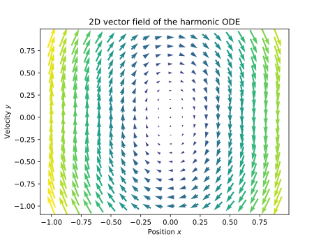
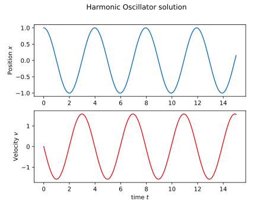
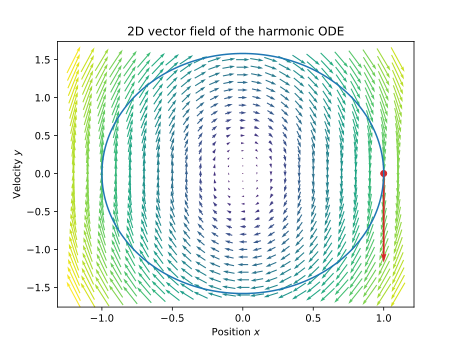
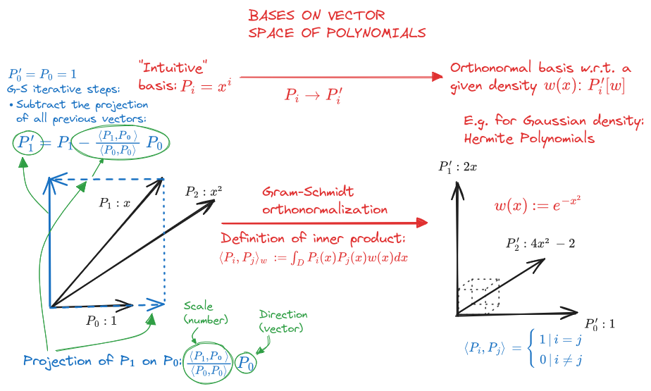

# Tutorial on Polynomial Chaos in Hamiltonian mechanics 
# Introduction
In this series of blog posts, I will explore the topic of my MSc thesis: the technique known as intrusive Polynomial chaos (PC) applied to Hamiltonian mechanics. We will explore its application to numerical solutions of stochastic differential equations, with a focus on uncertainty quantification in modelizations of Hamiltonian systems.

### Contents
* Part 1: we will go over a quick summary of the necessary background knowledge, such as ODEs, polynomials as vector spaces, 
`scipy` and `sympy`.
* Part 2: the definition and concepts of Polynomial Chaos Expansion will be explored, such as intrusive vs surrogate models.
* Part 3: we will look at the basic properties of Hamiltonian equations, and explain advanced concepts like Hamiltonian maps.
* Part 4: all the ingredients come together, creating a fully automated system to
  perform fast Uncertainty Quantification on the evolution of Hamiltonian systems using intrusive PCE, generating
  symbolic expressions which are then compiled to numerical functions suited for traditional ODE solver software.

> [!NOTE]
> A fully rigorous approach to the topic requires advanced knowledge of math, physics and statistics.
> However, this tutorial aims to be a sort of self-contained explanation, useful to a wide audience of
> students and tinkerers from varied backgrounds.
> 
> My goal is then to assume only basic knowledge of calculus and linear algebra and to try to provide the basic background facts.
> I will use images and code to explain concepts and formulas, if possible.

# Part 1: Introductory examples and definitions
In this section, we recall some basic facts of differential equations, vector spaces, 
polynomials, and the like. Feel free to skip and consult as needed if you are already familiar with all of these terms.

## Ordinary Differential Equations: the unidimensional harmonic oscillator
Let's have a look at the equation of motion of an unidimensional oscillator, a basic ordinary differential equation[^1] from physics:

[^1]: Recall that a differential equation is similar to a standard equation, but while the solution of the latter is a 
(potentially empty) set of numbers (which may be `Int` or `Real` or `Complex`), the solution of a DE is a set of functions.
In the simpler case where there is only one independent variable with respect to which the derivative is taken (like time in our example), it is 
called an Ordinary Differential Equation.

```math
x''(t)=-kx(t)
```

Here, $x(t)$ is a function that represents the position at time $t$ of a point mass that is constrained along a unidimensional axis $\hat x$. 
The mass is tied with an idealized spring pulling towards the origin of the axis (hence the negative sign, for a positive $k$). 
The mass of the particle has been absorbed inside the constant $k$, which represents the spring's "specific strength".
The notation $x''(t)$ represents the second derivative of the position with respect to time, also known as acceleration:
```math
x''(t)=\frac{d^2}{dt^2}(x)(t)
```
This means that is is a *second-order* ODE, as it involves the second derivative of the dependent variable $x$.

> [!TIP]
> It may be conceptually useful to consider the derivative $\frac{d}{dt}(f)$ as a higher order function that takes in a standard (first order) function, such as the position
> $x(t)$, and transforms it into another function, in this case the velocity $x'(t)$. The acceleration function $x''(t)$ is then simply the output of the HO function resulting
> from the composition of the derivative with itself, ie $\frac{d^2}{dt^2}(x)(t) = \frac{d}{dt}\big(\frac{d}{dt}(x)\big)(t)$.

> [!TIP]
> More in general, during our exploration it will sometimes be useful to consider the "type" of math expressions, analogous to
> types in computer science. I will use a pseudo type annotation syntax that should be fairly intuitive.
>
> In this simple example, both $x(t)$ and $x''(t)$ are `Real -> Real` scalar-valued functions of (scalar) time, while the "derivative operator"
> $\frac{d^2}{dt^2}$ would have type `(Real -> Real) -> (Real -> Real)`[^2].

[^2]: A more sophisticated model could represent
the incompatibility of the units of measurements of the different types of `Real` scalar numbers above by using a 
newtype pattern: `x(t): Time[Real] -> Position[Real]`, `x''(t): Time[Real] -> Acceleration[Real]`,
 `d^2/dt^2(f): (Time[Real] -> Position[Real]) -> (Time[Real] -> Acceleration[Real])`

## Solutions of the ODE
The solution of the harmonic ODE is a unique $x(t)$ function, for a given *initial condition*. The initial condition is specified by the values of the function and its 
derivatives at the initial time (usually $t=0$) from which we want to start from. For a second-order ODE, we need to specify two values, the position $x_0$ and the velocity $v_0$ at $t=0$:

```math
\begin{aligned}
x'(0)&=v_0\\
x(0)&=x_0\\
\end{aligned}
```

#### Reduction to first order
We may infer a very important trick by looking at the conditions above: in an ODE, we can exchange derivative orders for dimensions. In other words, by employing additional variables, 
we need to use only first-order derivatives to express the equation. In our example ODE, the unidimensional second order equation $x''(t)=-kx(t)$ becomes a bidimensional first-order ODE[^3] by using an additional variable $v(t)$,
the velocity of the particle:

[^3]: Note that it is still an ODE and not a Partial DE, since all derivatives are still taken with respect to the unique independent variable $t$. 
In other words, the solution of a multidimensional ordinary DE is just a collection or vector of functions depending on $t$, 
tracing a unidimensional trajectory in a higher-dimensional space.

```math
\begin{aligned}
  x'(t) &= v(t) \\
  v'(t) &= -kx(t)
\end{aligned}
```

Generalist numerical ODE solvers will almost always require as input a reduced system, as we will see later.

#### Exact solution
`TODO`

### Numerical solution
We will now show how to use Python and its associated numerical libraries to get an approximate solution for this ODE.
I recommend using `jupyterlab` and paste along the various code snippets (TODO: add complete notebook in repo+link).

First, let's import the required libraries:

```python
import scipy as sp
import numpy as np
import matplotlib.pyplot as plt
```

Let's define the parameters needed for our numerical solution:

```python
t0 = 0.  # Initial time
tf = 15. # Final time
t_span = (t0, tf) # Time span

k0 = 2.5 # Spring specific strength
initial_position = 1. # Starting position x_0
initial_velocity = 0. # Starting velocity v_0

y0 = (initial_position, initial_velocity) # Initial coordinates values

# Generate times to sample the output solution at
time_steps = 10000
tcoordinates = np.linspace(t_span[0], t_span[1], time_steps) 
```

Now, we need to define the function representing the derivative of $x$ and $v$, as function of $t,x,v$.
Note that in `scipy` the coordinates of a point of the state space are conventionally represented as `y`. In our case, $y = [x, v]$

```python
def derivative_field(t, y, k0):
    return np.array([y[1], 
                     -k0*y[0]])
```

This is effectively a vector field defined over our bidimensional space[^4] $y = [x, v]$,
which will be called the *state space* from now on (the code to make plots is omitted, see the notebook).




[^4]: Note that the absolute size of the arrows in the plot does not matter, just their relative size and direction: 
fundamentally, this is due to the fact that the vectors do not belong in the state space itself, but are rather elements
of their respective *tangent space*: a collection of vector spaces, one for each point of the state space. 
The tangent space is where the derivative lives.

###  Computing the solution with `scipy`
Now we have all the ingredients needed to compute a numerical solution using `scipy`. We will use the 
`solve_ivp` function (where `ivp` stands for "initial value problem").

```python
sol = sp.integrate.solve_ivp(derivative_field, t_span, y0, args=(k0,), 
                             method='DOP853', rtol=1e-13, atol=1e-13, 
                             max_step=1/100, t_eval=tcoordinates, 
                             dense_output=True, events=None, vectorized=False)
```

The positional arguments are the most important thing to understand: we pass our function
`derivative_field` with signature `derivative_field(t, y, *args)`, which returns the 
derivative at $t,y$. The solution is defined on the interval `t_span`, and the initial conditions
are in `y0`. Additional parameters for `derivative_field` are passed in `args`, in our case the
spring strength $k_0$.


If everything goes well, `sol` should print something similar to this:
```
  message: The solver successfully reached the end of the integration interval.
  success: True
   status: 0
        t: [ 0.000e+00  1.500e-03 ...  1.500e+01  1.500e+01]
        y: [[ 1.000e+00  1.000e+00 ...  1.522e-01  1.545e-01]
            [ 0.000e+00 -3.750e-03 ...  1.563e+00  1.562e+00]]
      sol: <scipy.integrate._ivp.common.OdeSolution object at 0x72a24eb806e0>
 t_events: None
 y_events: None
     nfev: 22517
     njev: 0
      nlu: 0
```
The field `sol.y` will contain our solution, a trajectory through the state space evaluated at each time `sol.t`.

## Overview of numerical methods for ODEs
`TODO`

## Visualizing the solution
Back to our harmonic oscillator: we can plot our solution to the equation in various ways. First, lets look at the components separately: we can observe the 
so-called harmonic motion in action, oscillating around the equilibrium point at the origin $x=0$.



Another possibility: we can ignore time and plot the solution $y=[x,v]$ directly on the state space. Here we can observe
the trajectory (in blue) determined by the the initial condition (the red dot, plotted with its derivative vector, not to scale).



There is a lot more that could be said about this simple ODE and its numerical solutions 
(Hamiltonian formulation, conserved quantities, symplectic methods...), but we will look into this later on, when we 
discuss the physical context.

## Orthogonal polynomials
Now, let's have a look at one key ingredient of Polynomial Chaos: the polynomials themselves.

### Polynomials as vector spaces
Vectors are often considered equivalent to mere arrays of numbers, especially when working in numerical code.
Sometimes, this equivalence may become a bit too reductive. In this section, we will look at polynomials from the point of view of vector spaces.
And then, the more theoretical definition of vector spaces will come in handy.

#### Properties of vector spaces
A vector space over a scalar field is a set of elements combined with a field of numbers, usually the real $\mathbb{R}$ or complex $\mathbb{C}$ numbers, with some binary operations between them satisfying 
some "linearity" properties: you can add elements and get another one, you can multiply ("scale") them by the field members, etc (see [wiki](https://en.wikipedia.org/wiki/Vector_space#Definition_and_basic_properties) for more information). 
Sometimes, you may have additional structure, such as [multilinear functionals](https://en.wikipedia.org/wiki/Linear_form) or [norms](https://en.wikipedia.org/wiki/Normed_vector_space).

> [!TIP]
> Elements of the vector set often use a different typeface than the elements of the field, to better distinguish vector variables from scalar numbers.
> Most commonly, the vectors are written in bold $\mathbf{z} = a\mathbf{u}+b\mathbf{v}$ or with an over arrow $\overrightarrow{v} = a\overrightarrow{u}+b\overrightarrow{v} $


#### Concept of basis of a vector space
A subset $\mathbf{e_i} = [\mathbf{e_0}, \mathbf{e_1}, \cdots]$ of the vector space is called a [basis](https://en.wikipedia.org/wiki/Basis_(linear_algebra)) of the space if, 
by summing and scaling its elements, we can generate every other vector in the space (and the element themselves are independent of each other).

```math
\mathbf{v} = v_0 \mathbf{e_0} + v_1 \mathbf{e_1} + \cdots
```

The representation of a vector as array or tuple of numbers is then simply an [isomorphism](https://en.wikipedia.org/wiki/Isomorphism) 
(roughly speaking, a mapping between vector spaces) from the original space $V$ where $\mathbf{v}$ lives, to the vector space $\mathbb{R}^n$ of tuples of the underlying scalar field,
equipped with the natural basis $\mathbf{e_0} = [1,0, \cdots ], \mathbf{e_1} = [0,1, \cdots ]$

```math
\mathbf{v} = v_0 \mathbf{e_0} + v_1 \mathbf{e_1} + \cdots \xRightarrow{\quad}  v_0 [1,0, \cdots ] + v_1 [0,1, \cdots ] \xRightarrow{\quad}  [v0, v1, \cdots]
```
#### Polynomials
A [polynomial](https://en.wikipedia.org/wiki/Polynomial) is an algebraic expression expressing a computation in terms of numerical constants and symbols called variables or indeterminates, involving only sum and multiplication.
For example, using the symbol $x$, a polynomial of degree $n$ may be expressed as

```math
P(x) := p_0+p_1x+p_2x^2+\cdots+p_n x^n\ .
```

Using two variables $x$ and $y$, a multivariate polynomial can be expressed as:
```math
P(x,y) := p_0+p_1x+p_2y + \cdots+p_{nm} x^ny^m\ .
```

#### Basis on the polynomial space
By using the standard definitions of sum and multiplication by a constant of symbolic expressions, we can define operations between polynomials. It is easy to
these operations satisfy the requirements of a vector space.

```math
\begin{aligned}
  P_1(x) &:= p_{0,0} + p_{0,1}x \\
  P_2(x) &:= p_{1,0}x + p_{1,2}x^2
\end{aligned} \xRightarrow{\quad} (P_1 + P_2)(x) = p_{0,0} + (p_{1,0} + p_{0,1})x + p_{1,2}x^2
```
There is a natural basis for a polynomial vector space of degree/dimension $n$: the basis formed by all possible monomials up to that degree.
For example, in one variable $x$:

```math
\mathbf{e_0} = 1,\ \mathbf{e_1} = x,\ \mathbf{e_2} = x^2,\ \cdots \ \mathbf{e_n} = x^n   
```

It is very easy to show that the operations of sum and multiplication by a constant applied to monomials can produce every polynomial up to the highest monomial degree.

#### Orthogonal bases
For the next step, we need to consider some additional structure on our vector space: an [inner product](https://en.wikipedia.org/wiki/Inner_product_space).
The inner product $\langle u,v \rangle$: `[Vec, Vec] -> Num` is an operation that takes in two vectors and produces a scalar, satisfying some properties of symmetry, linearity and positive-definiteness
(see wiki for more info). Moreover, an inner product induces a norm operation `Vec -> Num` (the length of a vector) on the space:

```math
|| v ||^2 = \langle v, v \rangle \textrm{ or equivalently, } || v || = \sqrt{\langle v, v \rangle}
```

For the purposes of Polynomial Chaos theory, the inner product $\langle P_i, P_j\rangle$ on the vector space of polynomials is defined as the definite integral 
of the product of the polynomials $P_i(x)P_j(x)$ over the domain 
$D$ of the variables, where each value of $x$ is weighted by a specified *weight* or *density function* $w(x)$

```math
\langle P_i, P_j\rangle _w\ := \int_D P_i(x)P_j(x)\,w(x)dx\ .
```

The relevance of the density function will become clearer later, once we approach the topic from the stochastic side. For now we will assume this definition
as axiomatic, and look at how it relates to the important notions of *orthogonality* and *orthonormality*.

An *orthogonal basis* is a basis where the inner product of two different basis vectors is zero. An *orthonormal basis*
has the additional property that the norm $|| e_i ||$ of each basis vector, or equivalently $\langle e_i, e_i\rangle$, is equal to $1$.
In other words,

```math
\langle e_i, e_j\rangle \ := \Bigg\{ \begin{aligned}
  1\ &|\ i=j \\
  0\ &|\ i \neq j
\end{aligned}
```

#### The Gram–Schmidt algorithm
It is easy to see that for most weights $w(x)$, the natural basis of monomials $e_i = x^i$ is not orthogonal in the space of polynomials.
For example, defining $w(x)$ as uniform between $0$ and $1$ : 

```math
w_u(x) \ := \Bigg\{ \begin{aligned}
  1\ &|\ 0 < x < 1 \\
  0\ &|\ \mathrm{otherwise}
\end{aligned}
```

we can easily compute the inner product of the first two elements $[e_0, e_1] = [1, x]$ of the natural basis, and is not zero:
```math
\langle e_0, e_1 \rangle_{w_u} \ = \langle (1), (x) \rangle_{w_u} = \int_\mathbb{R} 1 \cdot x\,w_u(x)dx = \int_0^1 1 \cdot x \cdot 1 dx = \frac{1}{2} \neq 0
```

How can we go from a non-orthonormal basis to an orthonormal one? There is an algorithm for that, 
the [Gram–Schmidt process](https://en.wikipedia.org/wiki/Gram%E2%80%93Schmidt_process).

In plain words, the core idea of the algorithm is to iterate over the non-orthogonal basis vectors 
and subtract from them their *projection* on all the previously processed basis vectors.
Central to this is the concept of [projection](https://en.wikipedia.org/wiki/Vector_projection) of a vector $\mathbf{v}$ onto another $\mathbf{u}$:

```math
\mathrm{Proj}_{\mathbf u} (\mathbf{v}) = \frac{\langle \mathbf{v}, \mathbf{u}\rangle}{\langle \mathbf{u}, \mathbf{u}\rangle} \,\mathbf{u}
```

The projection of a vector $\mathbf{v}$ onto $\mathbf{u}$ is another vector[^5] with the same direction as $\mathbf{u}$, scaled by their inner product and normalized
by the norm of $\mathbf{u}$.

[^5]: We could say that `Proj` has type `[Vec, Vec] -> Vec`, compared with the inner product which has type `[Vector, Vector] -> Num`.

The following pseudocode shows the GS process for polynomials (TODO expand a bit here, make example).

```
Input:
 M: Max degree;
 N : number of variables;
 inner product definition: domain D and density w

basis ← Monomial, non-orthogonal, basis, ex: [1, x, y, x2, xy, y2 , . . . , ]
polynomials ← Orthogonalized basis: [ basis[0] ]
snorms ← squared norms: [1, 1, . . .]
inner(v , u ; w) ← Inner product formula
for i ← 1 to length(basis) do    # For each monomial...
    for j ← 0 to i do
        projcoeff ← inner(basis[i], polynomial[j])      # Project on previous elements
        basis[i] ← basis[i] − projcoeff ∗ polynomial[j] # Subtract parallel parts
        snorms[j]
    end for
    snorms[i+1] ← inner(basis[i], basis[i]) 
    basis[i] ← basis[i] / sqrt(snorms[i+1])# Renormalize
    polynomial[i+1] ← basis[i]
end for

Output: (polynomials, snorms)
```

The following figure illustrates the process. Roughly speaking, the algorithm
removes the common component (the projection) from each pair of vectors and then normalizes them, 
until they are all orthonormal to each other.



## Introduction to `sympy`
`TODO`

### Polynomials in `sympy`
`TODO`

### The Gram–Schmidt algorithm in `sympy`
`TODO`

# Part 2: Polynomial Chaos
`TODO`

## Definition of PCE, advantages
`TODO`

## Intrusive PCE
`TODO`

## Examples in `sympy`
`TODO`

# Part 3: Fundamentals of Hamiltonian Mechanics
`TODO`

## Hamiltonian equations
`TODO`

### The harmonic oscillator, revisited
`TODO`

## Hamiltonian maps
`TODO`

## Stochastic hamiltonians, Monte Carlo approach
`TODO`

# Part 4: Putting it all together
`TODO`

## Stochastic Hamiltonian maps
`TODO`

## Automatic derivation of Hamilton equations in `sympy`
`TODO`

## Compiling `sympy` to `numpy` with `lambdify`
`TODO`

### Duffing hamiltonian example
`TODO`

## Uncertainty quantification in Hamiltonian systems
`TODO`
